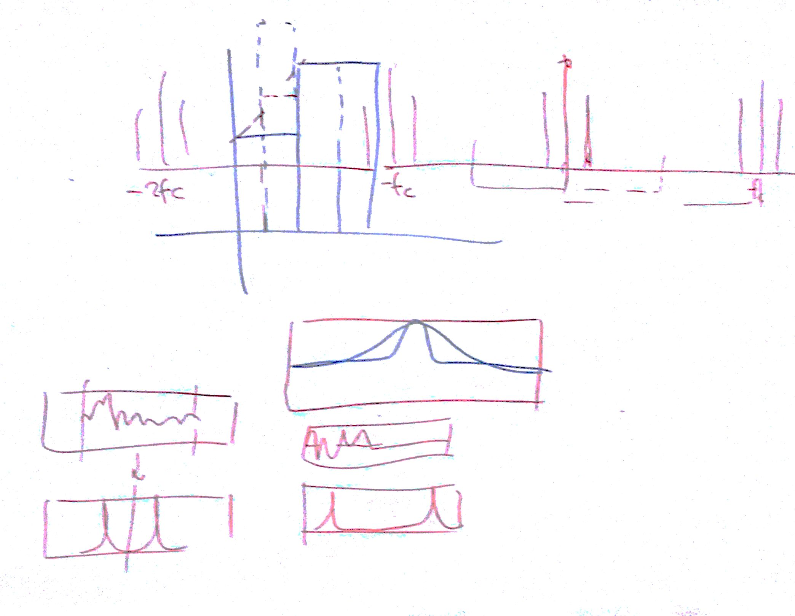

# Lezione del 1 giugno 2016

## Argomenti

* analisi della biunivocità dello zero-padding nella trasformata
  * zero-padding (ai bordi) nel tempo interpola le frequenze
  * zero-padding (interleaved) nelle frequenze interpola il tempo
