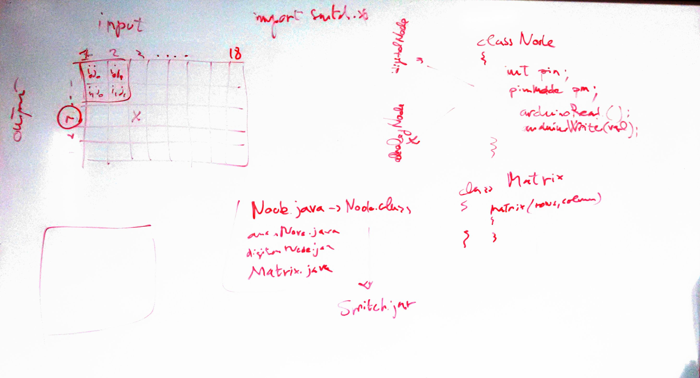

# Lezione del 8 gennaio 2016



* Progetto Bianco: **Connettore arduino-OSC**
  * Node.java
    ```java
    class Node
    {
      int pin;
      pinMode pm;
      arduinoRead();
      arduinoWrite();
    };
    class analogNode extends Node;
    class digitalNode extends Node;
    class Matrix
    {
      Matrix(rows, cols)
      {
      }
    };
    ```
  * libreriea `Switch.jar`

## Compiti per casa

* realizzare la libreria `Switch.jar` 
